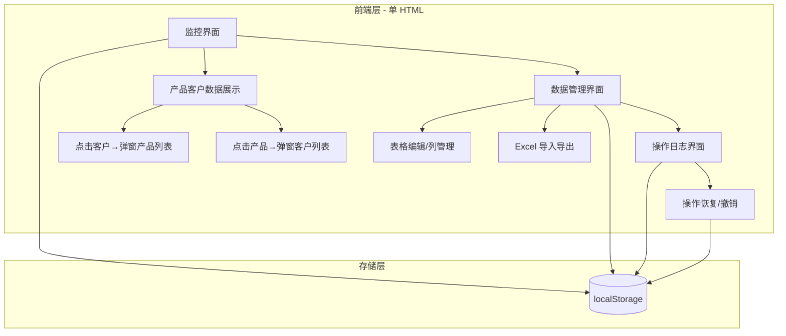
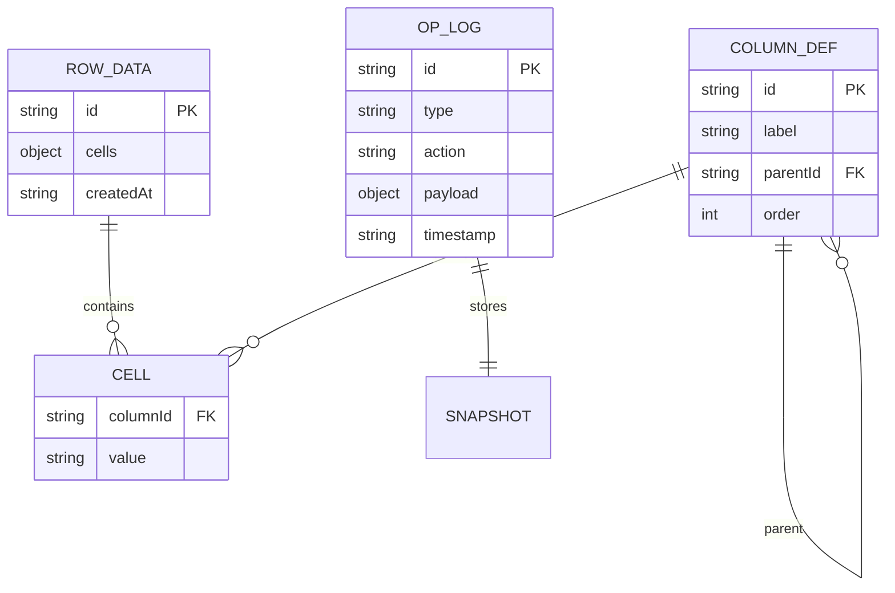

# 项目设计文档 - 昆山飘得华电子材料有限公司产品客户管理系统

## 1. 系统架构



## 2. 数据模型



## 3. 核心数据结构

### 3.1 列定义（支持父子列）
```javascript
{
  id: string,      // 唯一标识
  label: string,   // 列名
  parentId: string | null,  // 父列 ID，null 表示顶级列
  order: number    // 排序
}
```

### 3.2 行数据
```javascript
{
  id: string,
  cells: { [columnId: string]: string },  // 列ID → 单元格值
  createdAt: string
}
```

### 3.3 操作日志
```javascript
{
  id: string,
  type: 'column' | 'row' | 'cell',
  action: 'add' | 'delete' | 'update',
  payload: object,  // 操作前的快照，用于恢复
  timestamp: string
}
```

## 4. 页面清单

| 页面 | 功能 |
|------|------|
| 监控界面 | 仪表盘式数据总览、产品-客户关系图、点击客户/产品弹窗详情 |
| 数据管理界面 | 可编辑表格、添加/删除整列、父子列、修改列名、Excel 导入导出 |
| 操作日志界面 | 操作历史列表、单条恢复/撤销、恢复后同步监控与数据管理 |

## 5. 前端设计规范

### 5.1 设计方向
- 美学风格：工业制造风格 + 毛玻璃层叠
- 设计关键词：专业、清晰、可靠、数据密集、层次分明

### 5.2 色彩体系
- 主色：#2563eb（蓝）
- 辅色：#64748b（灰）
- 强调色：#0ea5e9（青）
- 中性色：slate 50-950
- 语义色：Success #22c55e / Warning #f59e0b / Error #ef4444 / Info #3b82f6

### 5.3 字体体系
- 标题：阿里巴巴普惠体 / system-ui
- 正文：阿里巴巴普惠体
- 字号：xs(12) / sm(14) / base(16) / lg(18) / xl(20) / 2xl(24)

### 5.4 间距与布局
- 4px 基准，间距阶梯 8/12/16/24/32
- Flex/Grid 布局，响应式断点

### 5.5 动效规范
- 过渡 200ms ease
- 弹窗淡入、表格行 hover 高亮
- 操作 Toast 反馈
